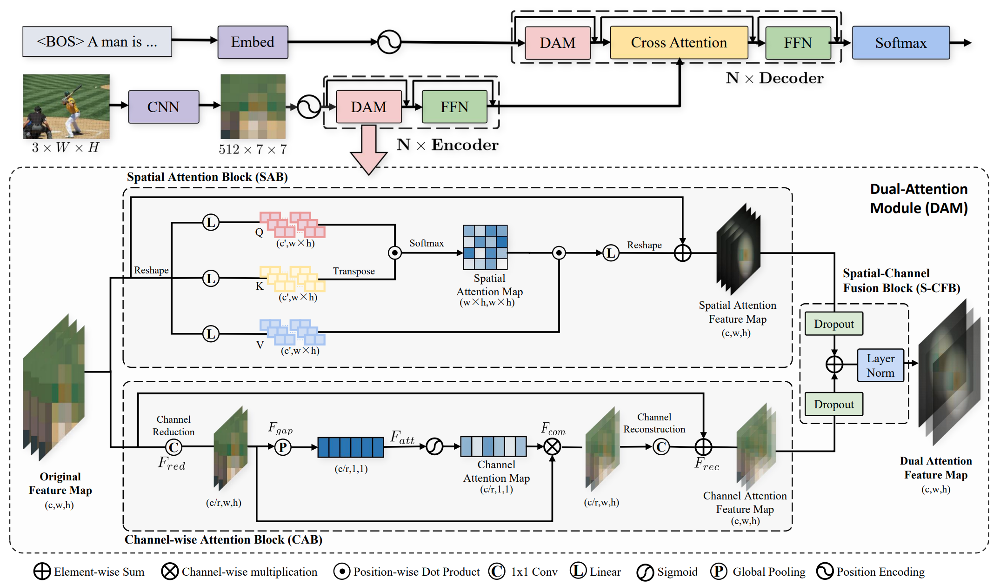

# Knowing what it is: Semantic-enhanced Dual Attention Transformer
Official Code for "Knowing what it is: Semantic-enhanced Dual Attention Transformer" (TMM2022)



## Environment setup

Please refer to [meshed-memory-transformer](https://github.com/aimagelab/meshed-memory-transformer)

## Data preparation

* **Annotation**. Download the annotation file [annotation.zip](https://drive.google.com/file/d/1i8mqKFKhqvBr8kEp3DbIh9-9UNAfKGmE/view?usp=sharing). Extarct and put it in the project root directory.
* **Feature**. You can download our ResNeXt-101 feature (hdf5 file) [here](https://pan.baidu.com/s/1xVZO7t8k4H_l3aEyuA-KXQ). Acess code: jcj6.
* **evaluation**. Download the evaluation tools [here](https://pan.baidu.com/s/1xVZO7t8k4H_l3aEyuA-KXQ). Acess code: jcj6. Extarct and put it in the project root directory.

## Training
```python
python train.py --exp_name SDATR --batch_size 50 --rl_batch_size 100 --workers 4 --head 8 --warmup 10000 --features_path /home/data/coco_grid_feats2.hdf5 --annotation /home/data/m2_annotations --logs_folder tensorboard_logs
```
## Evaluation
```python
python eval.py --batch_size 50 --exp_name SDATR --features_path /home/data/coco_grid_feats2.hdf5 --annotation /home/data/m2_annotations
```


Pretrained model is available [](). Acess code: xxx.
By evaluating the pretrained model, you will get
```bash
{'BLEU': [0.8130918073281019, 0.6613944708299153, 0.5173751961764315, 0.3973754802778509], 'METEOR': 0.29504133552506084, 'ROUGE': 0.5914517025819723, 'CIDEr': 1.3447844386129792, 'SPICE': 0.23130604798677026}
```